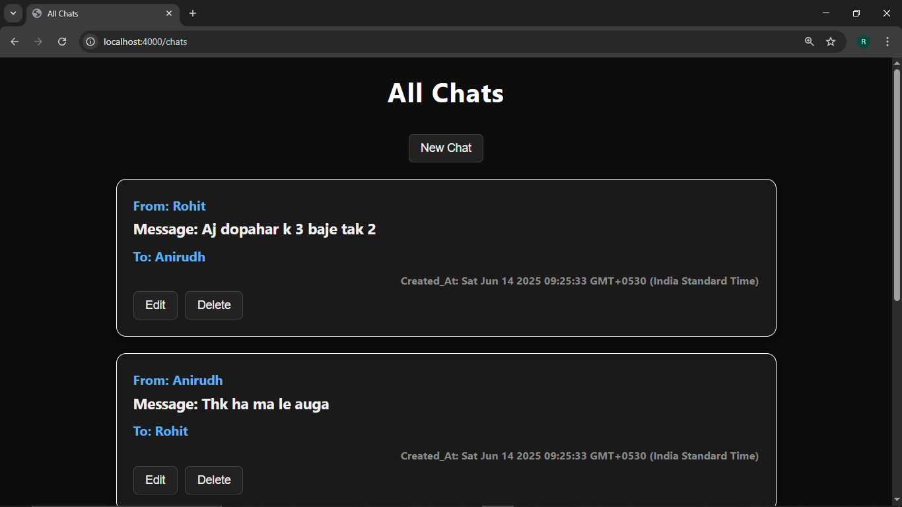
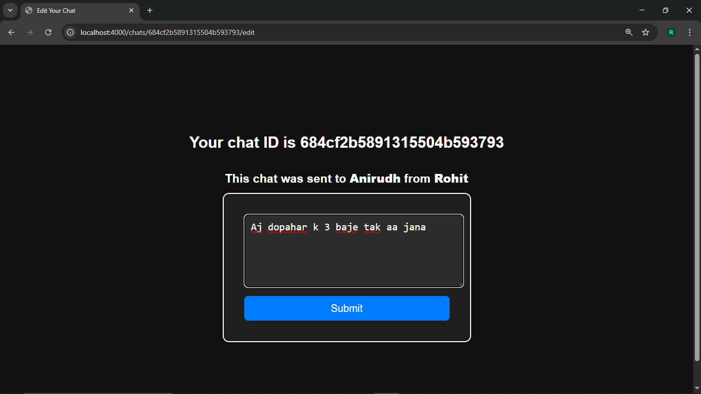
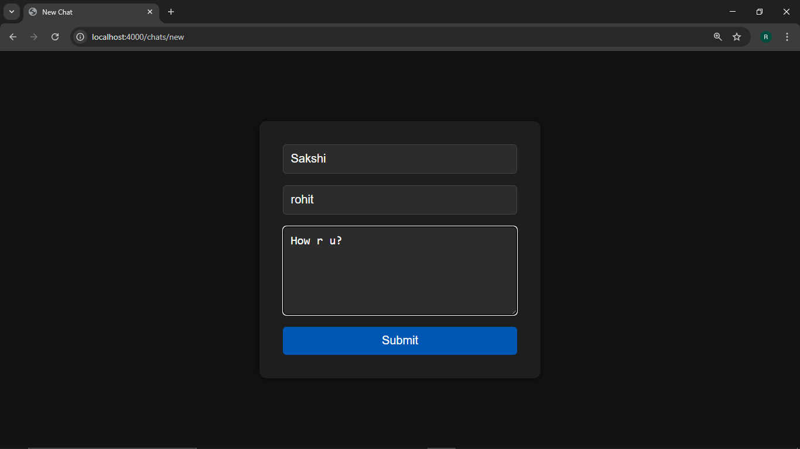

# WhatsApp-style Chat App 💬

This is a simple chat application inspired by WhatsApp, built using **Node.js**, **Express**, **MongoDB**, and **EJS**. It supports basic CRUD operations on chat messages like viewing, creating, editing, and deleting.

## 📸 Screenshots

  

  

    

---

## 🛠 Tech Stack

- **Backend:** Node.js, Express.js
- **Database:** MongoDB (using Mongoose)
- **Templating Engine:** EJS
- **Middleware:** Method-Override
- **Styling:** Basic CSS (in `public/` folder)

---

## 🚀 Getting Started

### Prerequisites

- Node.js installed
- MongoDB installed and running locally
- Git (optional, for version control)

### Installation

1. **Clone the repository**
   ```bash
   git clone https://github.com/yourusername/chat-app.git
   cd chat-app
